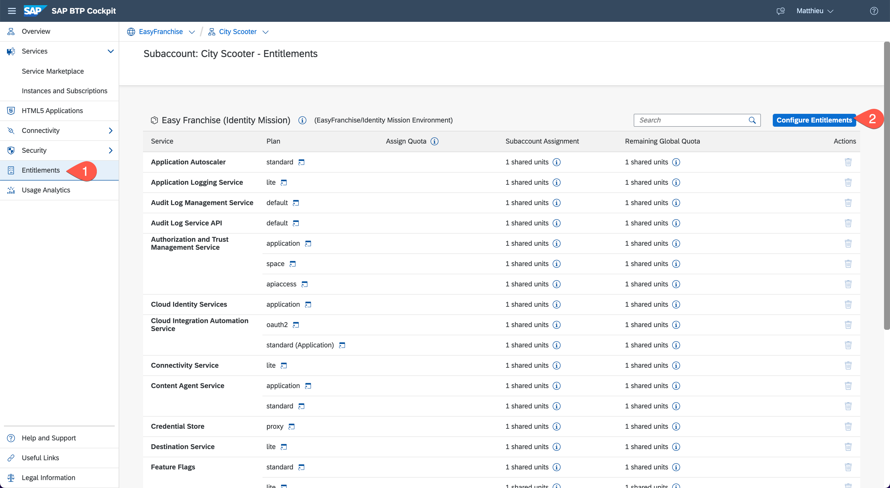
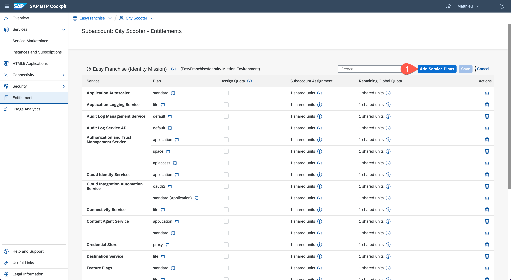
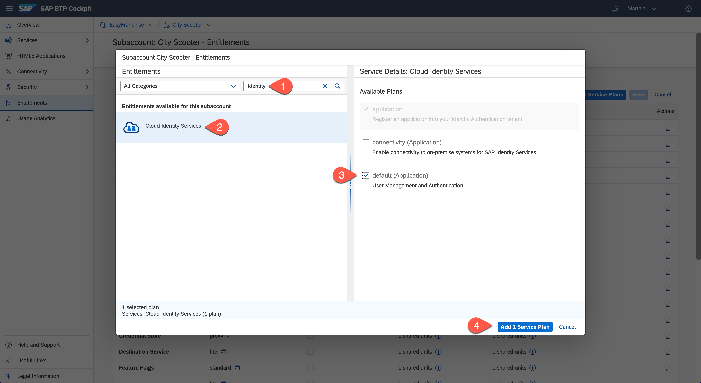
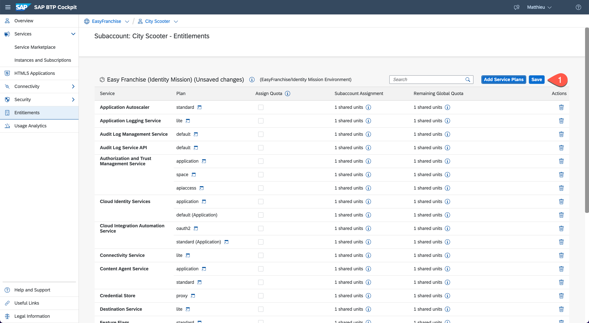
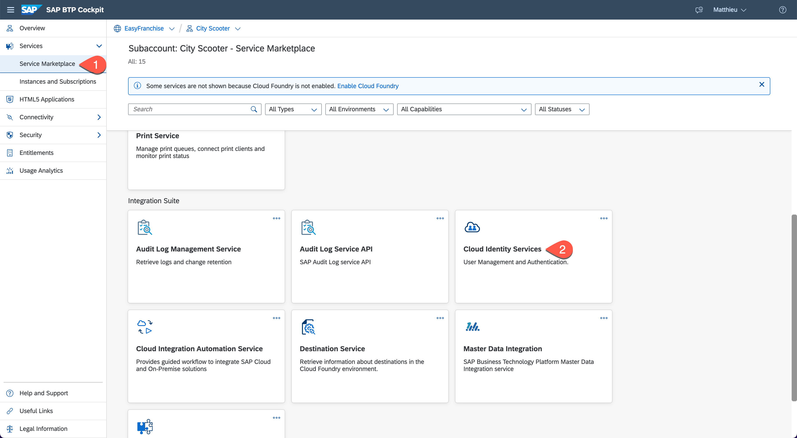
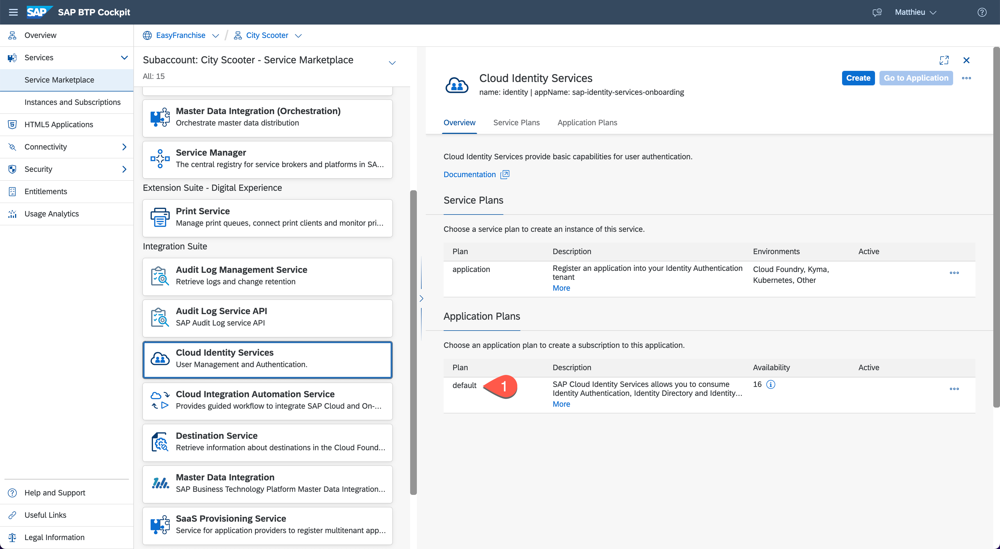
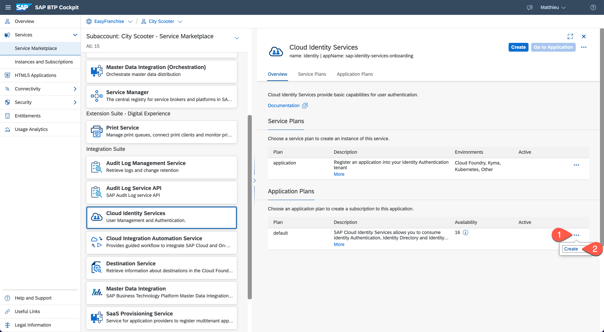
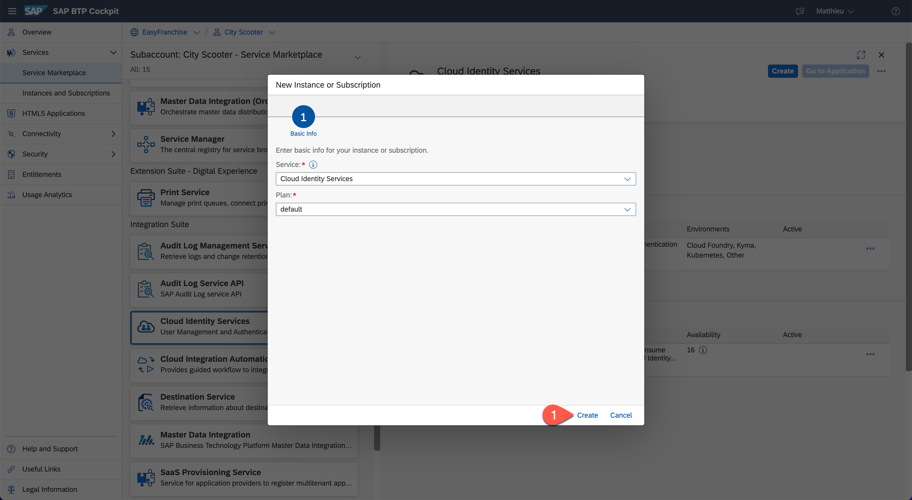
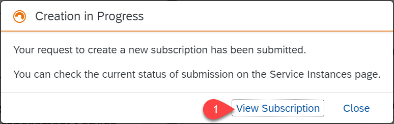

# Get a Tenant of the Identity Authentication Service

The Identity Authentication service provides you with controlled cloud-based access to business processes, applications, and data. It simplifies your user experience through authentication mechanisms, single sign-on, on-premise integration, and convenient self-service options. Find more details about the Identity Authentication service at [SAP Discovery Center](https://discovery-center.cloud.sap/serviceCatalog/identity-authentication/?region=all).

As an SAP partner or customer using SAP BTP, you always have an Identity Authorization tenant (with default plan) available. To get it, follow these steps:

> **Note for SAP employee:** to request an internal tenant, search for the details in the corporate search.

1. In the SAP BTP cockpit, navigate to the subaccount of the customer City Scooter.

1. Choose **Entitlements** >  **Configure Entitlements**.
   
     

1. Then choose **Add Service Plans**.
   
     

1. Find and select **Cloud Identity Services** in the pop-up dialog. Select the **default plan** checkbox and add it as service plan.
    
    

1. Save the changes on the **Entitlements** page.
   
     

1. Choose **Services** > **Service Marketplace** and select the **Cloud Identity Services** tile.
   
     

1. Under **Application Plans** you should see the **default** plan.

     

1. Choose the **Actions (...)** button for the default plan and then choose **Create**.

     

1. Verify that **default** is selected as plan and choose **Create** to start creating the instance.

     

1. In the upcoming dialog select **View Subscription**.
   
    

1. Verify under **Instances and Subscriptions** that the status of **Cloud Identity Services** has been updated to **Subscribed**.

To learn more about tenant models and how to get an Identity Authorization tenant, see [Tenant Model and Licensing](https://help.sap.com/viewer/6d6d63354d1242d185ab4830fc04feb1/Cloud/en-US/93160ebd2dcb40e98aadcbb9a970f2b9.html) at SAP Help Portal.
