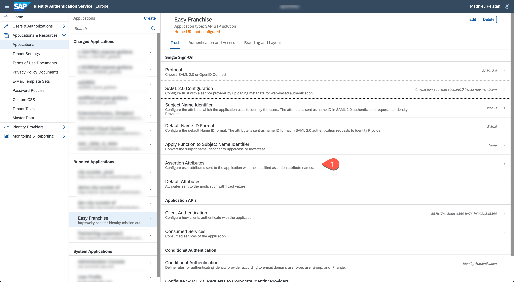
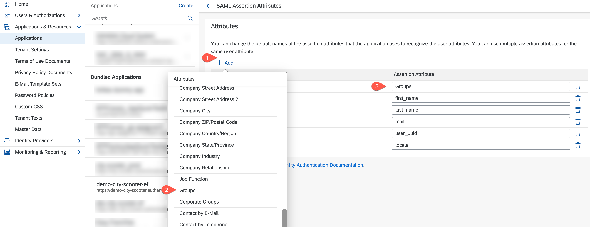

# Set Trust between Identity Authentication Tenant and a Subaccount in SAP BTP
For more details, please refer to [Manually Establish Trust and Federation Between UAA and Identity Authentication](https://help.sap.com/viewer/65de2977205c403bbc107264b8eccf4b/Cloud/en-US/7c6aa87459764b179aeccadccd4f91f3.html#loio7c6aa87459764b179aeccadccd4f91f3) in the SAP official documentation.

## Import Identity Authentication Service Metadata in SAP BTP Subaccount
1. Open your Identity Authentication tenant and navigate to **Applications & Ressources** > **Tenant Settings**. Then select **SAML 2.0 Configuration**.
 

1. Press **Download Metadata File**.
 

1. Open now your SAP BTP Subaccount (e.g. city-scooter) and navigate to **Security** > **Trust Configuration** and click the button **New Trust Configuration**.

1. Then upload the metadata file previously downloaded.
  

1. Fill out fields **Name**, **Description** and **Link Text for User Logon**. Then **Parse** the details and **Save** the details.

## Import SAP BTP Subaccount Metadata in Identity Authentication Service
1. In your SAP BTP subaccount, download the SAML metadata data of your subaccount by clicking **SAML Metadata** under **Security** > **Trust Configuration**. 
 

1. Open your Identity Authentication tenant and navigate to **Applications & Ressources** > **Applications** and press the button **Create**. 
 

1. Then fill the fields **Application Display Name** and **Application Type**. Click save.

1. In the newly created application, click **SAML 2.0 Configuration**.

1. Then upload metadata file downloaded in SAP BTP subaccount previously.

1. Navigate to **Default Name ID Format**.

1. Select **E-Mail** as unique attribute and click **Save**.

1. Navigate to **Assertion Attributes**.

1. Add the new user attribute **Groups** from the dropdown-list and click **Save**.

1. Navigate to **Assertion Attributes**.

1. Select **Login Name** in the dropdown box and click **Save**.

Gratulation, you have now a trust established between the customer IAS tenant and his dedicated SAP BTP subaccount.

<!-- > **_NOTE:_** After completing the trust setup, when accessing the application, there is one more IdP entry with text which you filled. To test user propagation, please always use that link for user login instead of other links (e.g. "Default Identity Provider").  -->
