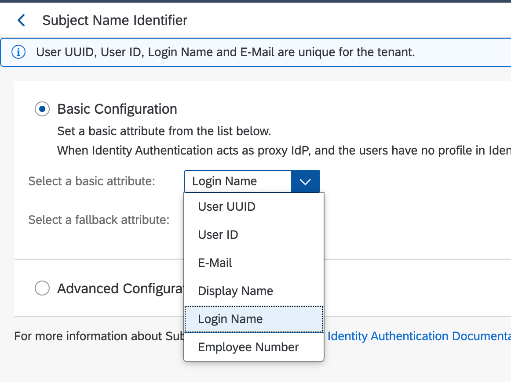
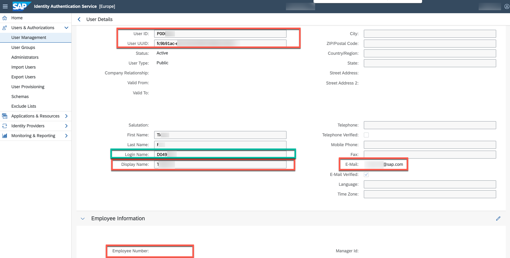
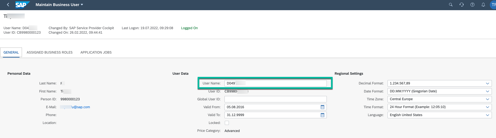

# Set Trust between Identity Authentication Tenant and a Subaccount in SAP BTP
For more details, please refer to [Manually Establish Trust and Federation Between UAA and Identity Authentication](https://help.sap.com/viewer/65de2977205c403bbc107264b8eccf4b/Cloud/en-US/7c6aa87459764b179aeccadccd4f91f3.html#loio7c6aa87459764b179aeccadccd4f91f3) in the SAP official documentation.

## Import Identity Authentication Service Metadata in SAP BTP Subaccount
1. Open your Identity Authentication tenant and navigate to **Applications & Ressources** > **Tenant Settings**. Then select **SAML 2.0 Configuration**.
 

1. Press **Download Metadata File**.
 

1. Open the customer SAP BTP Subaccount (e.g. city-scooter) and navigate to **Security** > **Trust Configuration** and click the button **New Trust Configuration**.

1. Then upload the metadata file previously downloaded.
  

1. Fill out fields **Name**, **Description** and **Link Text for User Logon**. Then **Parse** the details and **Save** the details.

1. By saving the new trust configuration, a new category named **Custom** should be added. Verify that the new configuration for the Identity Authentication service tenant is now visible in this category and that it's active.

## Import SAP BTP Subaccount Metadata in Identity Authentication Service
1. In your SAP BTP subaccount, download the SAML metadata data of your subaccount by clicking **SAML Metadata** under **Security** > **Trust Configuration**. 
 

1. Open your Identity Authentication tenant and navigate to **Applications & Ressources** > **Applications** and press the button **Create**. 
 

1. Then fill the fields **Application Display Name** and **Application Type**. Click save.

1. In the newly created application, click **SAML 2.0 Configuration**.

1. Then upload metadata file downloaded in SAP BTP subaccount previously.

1. Navigate to **Default Name ID Format**.

1.  Select **E-Mail** as unique attribute and click **Save**. 

1. Navigate to **Assertion Attributes**.

1. Add the new attribute **Groups** from the dropdown-list. Note that the attribute **Groups** is case sensitive but automatically filled as **groups** (first letter is in lower case). Please change it to **Groups** then click **Save** button.

1. Navigate to **Subject Name Identifier**.

1. Select **Login Name** in the dropdown box and click **Save**. This means that the the Identity Authentication sends the **Login Name** as `name ID` in the SAML 2.0 assertions, by which the applicaiton can identity the user. Depending on your Identity Authentication Service configuration, you might need a different mapping. For more details please refer to [Configure the Subject Name Identifier Sent to the Application](https://help.sap.com/docs/IDENTITY_AUTHENTICATION/6d6d63354d1242d185ab4830fc04feb1/1d020e3a3ba34c43a71fde70bfa6419a.html)

> **NOTE:** You can select from the below attributes list the subject name identifier in Identity Authentication tenant. For [Principal Propagation](../../propagate-identity/README.md) to work, the choice of the attribute depends on the user settings of the S/4 HANA Cloud system. 
> 
>
> To check the value of each attribute in your Identity Authentication tenant, please navigate to **User & Authorization** > **User Management** > and select single user to view the details.
>
> 

> In our example the **Login Name** of the S/4 HANA system is used as unique identifier. Therefore, the choice of attribute in Identity Authentication tenant has to match the one in S/4 HANA system. The configuration in your landscape may differ.
>
> 

Congratulation! You have now established trust between the customer Identity Authentication tenant and its dedicated SAP BTP subaccount.
