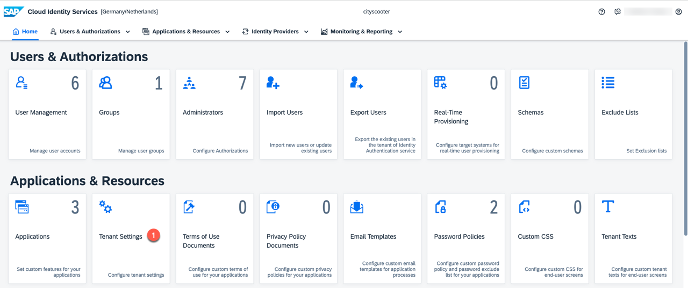
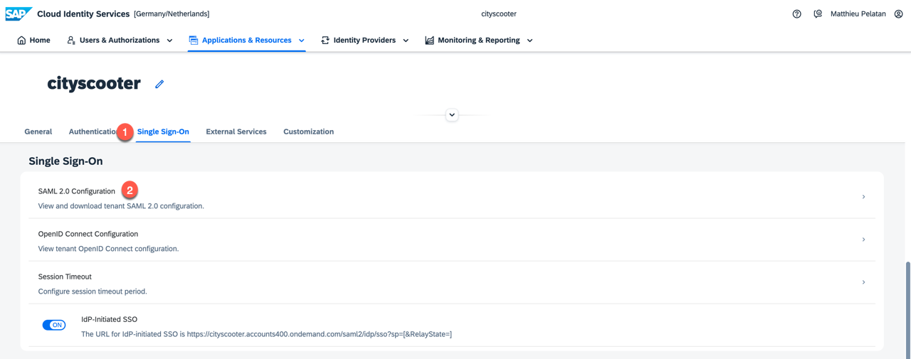
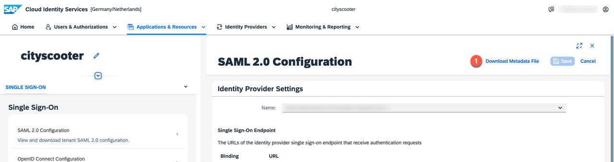
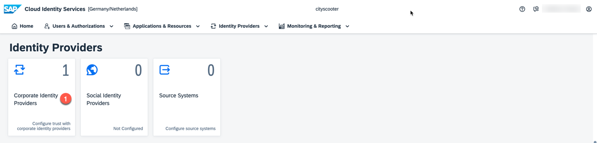
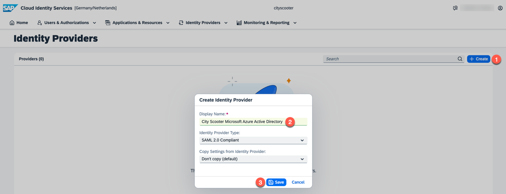
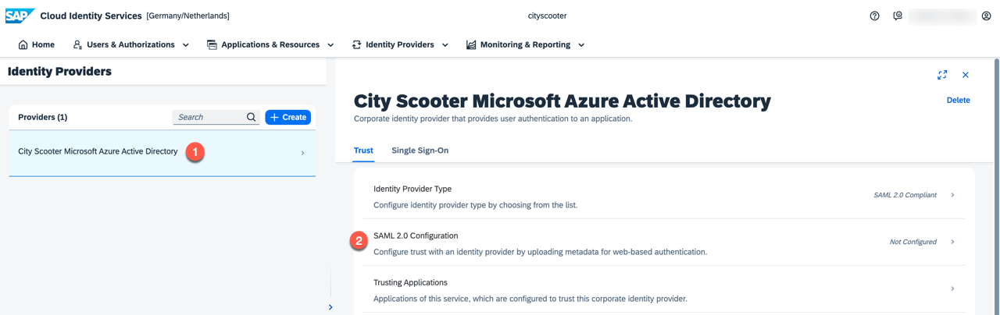
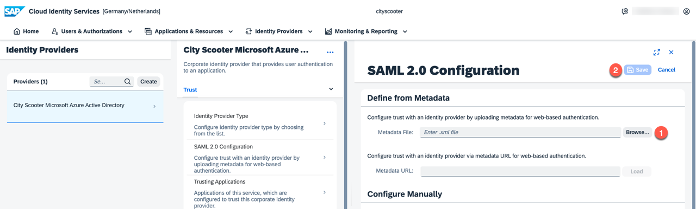
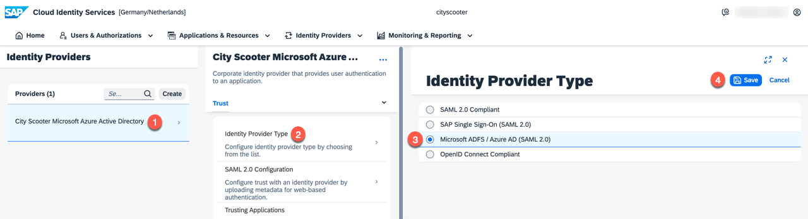
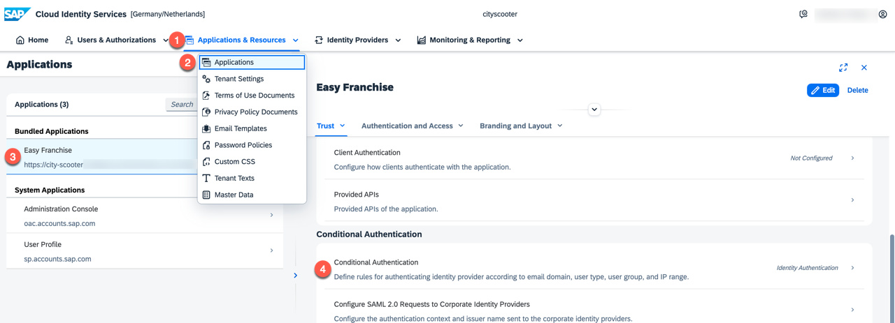

# Establish Trust Between Microsoft Azure Active Directory and SAP Identity Authentication Service

Previously we have already prepared the Identity Authentication service and established trust with the corresponding subaccount.

In this chapter we show case the steps to configure the enterprise application in the Microsoft Azure AD as corperate identity provider. If you are not using Microsoft Azure AD you can still have a look at the steps below as the approach should be quite similar.

## Download SAML 2.0 Metadata from Identity Authentication Service 

1. Open the **Identity Authentication Service** and choose **Tenant Settings** under **Applications & Resources**.

   

1. Then choose **SAML 2.0 Configuration** under **Single Sign-On**.

   
1. Download the metadata file.

   

## Upload SAML 2.0 Metadata to Microsoft AAD Enterprise Application

1. Open **Microsoft Azure Active Directory** and select the **Enterprise Application** which you have already created.
1. Click the menu item **Single sign-on** and select **SAML**.

   
1. Upload the previously downloaded SAML2 metadata file from the **Identity Authentication Service**.

   
1. **Save** the imported SAML Configuration.

   

1. After you saved the SAML configuration, you can find more details in the **Basic SAML Configuration** section. In the section **SAML Signing Certificate** the **Federation Metadata XML** download is enabled. Download the XML file.

   

## Enable your Corporate Identity Provider in the Identity Authentication Service

1. Open the Identity Authentication service, expand the **Identity Providers** menu and click **Corporate Identity Providers** .

   
1. Click **create** provide a meaningful name e.g. **City Scooter Microsoft Azure Active Directory** in the dialog. Then click **Save**. 

   

## Upload federation Metadata file in the Corporate Identity Provider Configuration of the Identity Authentication Service
1. Select the new created corporate identity provider and click on **SAML 2.0 Configuration**.

   
1. Upload the federation metadata file  and click **Save**. 

   

## Update the Provider Type to Microsoft ADFS / Azure AD (SAML 2.0) in the Cooperate Identity Provider Configuration of Identity Authentication Service
1. Select the **Identity Provider Type** and choose the identity provider type **Microsoft ADFS / Azure AD (SAML 2.0)** and click **Save**.

   

## Configure Default Identity Provider in the Application of Identity Authentication Service

1. In the Identity Authentication service select your application. Open **Conditional Authentication**.

      
1. Select the correct **Microsoft Azure Active Directory** as default identity provider for your application and click **Save**.
     

## Update Attributes & Claims Settings in the Enterprise Application of Microsoft Azure

1. Login to the **Microsoft Azure Active Directory** and select your enterprise application. Then select **Single  sign-on** and edit the **Attributes & Claims**. 
   
2. We need the following claims:
   * Required claim - claim name: **nameidentifier**
     * namespace: http://schemas.xmlsoap.org/ws/2005/05/identity/claims 
     * source: **Attribute**
     * source attribute: **user.onpremisessamaccoountname**
     > **NOTE**: the **source attribute** depends on your S/4 HANA setting. E.g. if you are using email as unique identifier, please use **user.mail**.
   * Manage claim - claim name: **first_name**
     * namespace: empty string
     * source: **Attribute**
     * source attribute: **user.givenname**
   * Manage claim - claim name: **last_name**
     * namespace: empty string
     * source: **Attribute**
     * source attribute: **user.surname** 
   * Manage claim - claim name: **mail**
     * namespace: empty string
     * source: **Attribute**
     * source attribute: **user.mail**
   * Group  claim - claim name: **Groups**
     * Which groups associated with the user should be returned in the claim?: **Groups assigned to the application**
     * source attribute: **Group ID**
     * Enable **Customise the name of the group claim** and insert **Groups** as name (case-sensitive)
     
     
     
     For further details of above options please refer [official document](https://docs.microsoft.com/en-us/azure/active-directory/hybrid/how-to-connect-fed-group-claims#add-group-claims-to-tokens-for-saml-applications-using-sso-configuration)

1. Finally check the attributes & claims overview. You should have something similar as in the picture below: 
   
   

