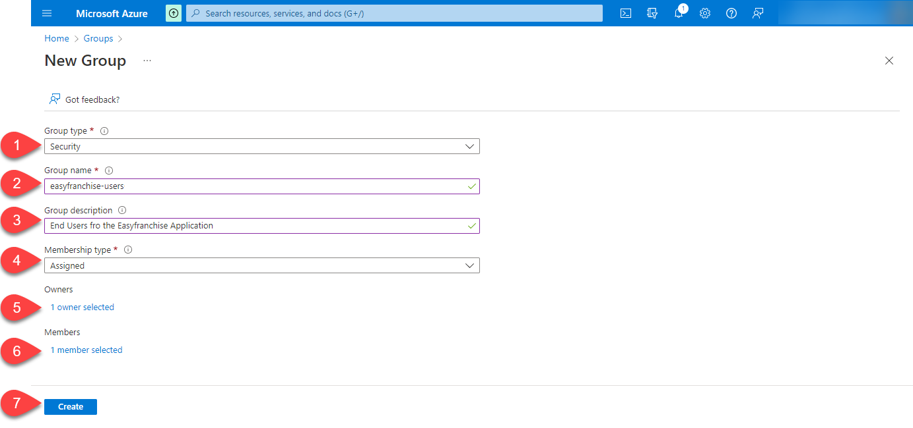

# Manage End User Access for the EasyFranchise Application

In Microsoft Azure Active Directory we will first create a new group and assign the group to the enterprise application configured previously. Then the group will be mapped to the Easy Franchise role collection defined in the SAP BTP subaccount to enable the user authorizatoin. Finally we will disable the user store in the Identitiy Authentication service so that all user attributes are retrieved from Microsoft Azure Active Directory.

## Create new Group in Microsoft Azure

1. Open **Microsoft Azure** in the browser and navigate to **Groups**.
 
   
1. Click **New group**. 
   
   
1. Create a new group by inserting the following details and press **Create**:
   * Group type: **Security** 
   * Group name: e.g. **easyfranchise-users** , here you can chooseany group name you want as the name will not be needed by defining the mapping with the role collection. We will need only the **Object Id** of the group. 
   * Group description: provide here a meaningful text.
   * Membership type: **Assigned**.
   * **Owners**: add your name.
   * **Members**: add your name and optionally other Easy Franchise end users. 

   
1. After you have created the group, select it and note down the **object Id** as it will be needed later.
  
   

## Add user Group to Enterprise Application

1. Open **Microsoft Azure** in the browser and navigate to **Enterprise Application**, and find your application.

1. Navigate to **Users and groups** on the left, click on **Add user/group**, then add the group **easyfranchise-users** to the application. At the end you should see a similar screen as below.

   

## Disable User Store in Identity Authentication Tenant

1. Open the Identity Authentication service and navigate to **Identity Provider** > **Corporate Identity Providers**. Then select the corporate identity.

   

1. Make sure the **Use Identity Authentication user store** is **off**.

   

## Define the Easy Franchise User Group in SAP BTP

1. Open the SAP BTP Cockpit and log on to the customer SAP BTP subaccount (eg. City Scooter).
1. Open **Security > Role Collections** on the left side menu and choose the **Easyfranchise Backend** role collection and click on the **Edit** button. 
1. In the **User Groups** section on the left side, add a new line with your Identity Provider and the group **object id** from the Microsoft Azure group. The already existing **easyfranchise-users** group, which was needed when you did not use Microsoft Azure, can be deleted or remain. 

   
   
## Run the Easy Franchise Application

Now that everything is configured, we can launch the application.  Make sure that your user is a member of the **easyfranchise-users** group in Microsoft AAD. 
   

1. Find the Easy Franchise Application URL in the subscription area of the  Cityscoot subaccount. Launch it in a new incognito browser session.
1. On the welcome page, select the your CityScooter Identity Provider.
   
   

1. This should now forward you to the configured Cooperate Identity Provider for login.
1. Find franchises in the according table. 

   
1. Once successfully logged in, please take a look at the user in your subaccount in SAP BTP. A shadow user should have been created latest after the first login.

   

## Disable the Default Identity Provider

By starting the application, you always have to to select first the right identity provider now. As we we don't need the default identiy provider anymore, we will swich it off.  

1. Open the customer SAP BTP subaccount (e.g. city-scooter) and navigate to **Security** > **Trust Configuration**. 

1. Press **Edit** in the **default identity provider** row.

   
2. Disable the the user login by removing the check on **Available for User Logon** and **Save**.

   
3. Clear your browser cache and run the application again. The step to select the right identity provider should no longer be requested.
