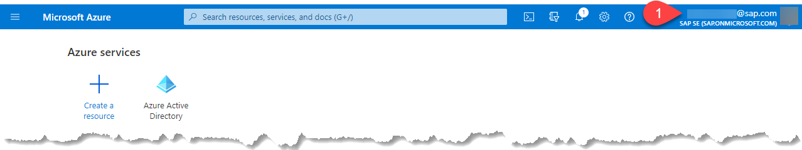
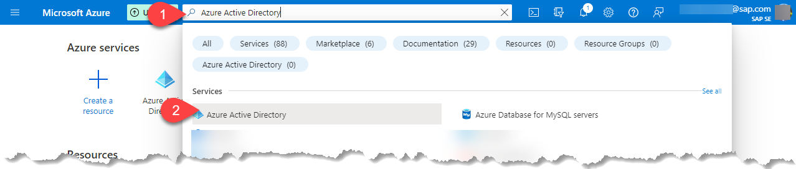
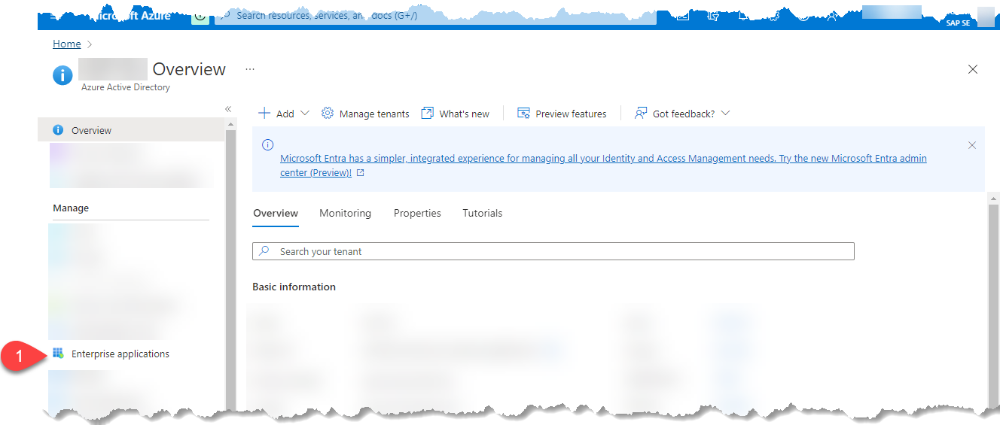
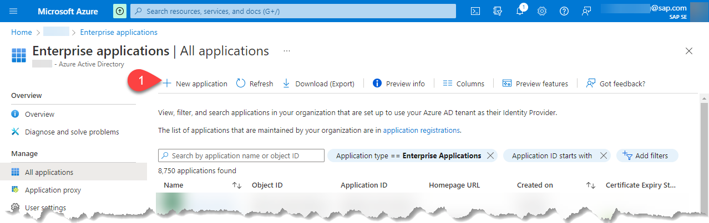
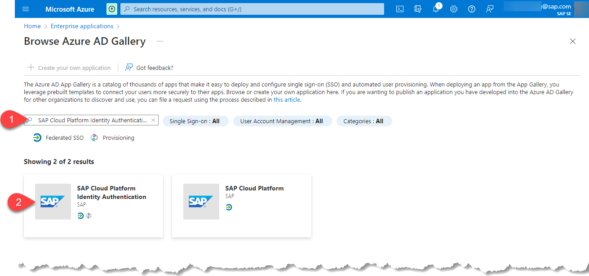
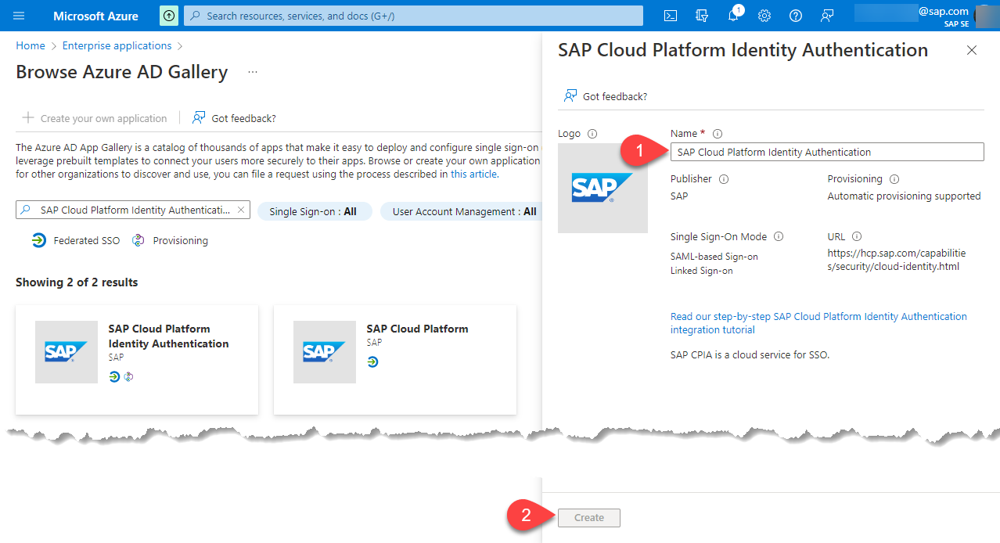

# Prepare Corporate Identity Provider

So far, we have replaced the usage of SAP Authorization and Trust Management service with SAP Cloud Identity Services - Identity Authentication to manage the customer users. Now, we go further and we assume that the customer has its own identity provider and we want to federate it by using the Identity Authentication service as a proxy. The authentication requests sent to SAP Cloud Identity Authentication will be then redirected to the customer identity provider.

In our case, we will use Microsoft Azure Active Directory as a corporate identity provider. You can of course use any other custom identity providers of your choice.

We assume that you have already a corporate identity provider like Microsoft Azure Active Directory. If this is not the case you can have a look at [trial offerings](../get-azure-ad-free-account/README.md). 
 
## Create an Enterprise Application in the Corporate Identity Provider

When an enterprise application is registered in an Microsoft Azure AD tenant, users who have been assigned to it can securely access it.  For more information, read [What is application management in Azure Active Directory?](https://docs.microsoft.com/en-us/azure/active-directory/manage-apps/what-is-application-management. In our scenario an administrator of City Scooter has to create an enterprise application in **Azure Active Directory** of type **SAP Cloud Platform Identity Authentication**. 

> Note: We will explain here the different steps needed to configure a Microsoft AAD. If you are not using the same corporate identity provider, you can still have a look at the step below because the approach should be quite similar.

> Note: for SAP colleagues read this [page](https://github.tools.sap/saas-extension-on-kyma/easyfranchise-internal-appendix/blob/main/btp-kyma-identity-management/README.md#how-to-create-an-internal-enterprise-application-on-microsoft-azure-active-directory) for more details on how to create an enterprise application. 

1. Login to **Azure Portal** by going to https://portal.azure.com and make sure you are using the right directory within the Azure subscription. The current directory is displayed below your user name. If it’s not the one you want to use, click on your profile and choose **Switch Directory** to select the wanted one. 
 
   
1. Open the **Azure Active Directory** service. If you can't find it in the home page search for **Azure Active Directory** on the top of the page and select the according entry.
   
   
1. Click the menu item **Enterprise applications**.  
   
   
1. Click **New application** to create a new enterprise application. 

   
1. In the **Azure AD Gallery** search for **SAP Cloud Platform Identity Authentication** template and select it. 
   
   
1. A new column on the right side will appear to give the application a name. Give the application a name e.g. "Easy Franchise Identity" and click **create**.

   

    

