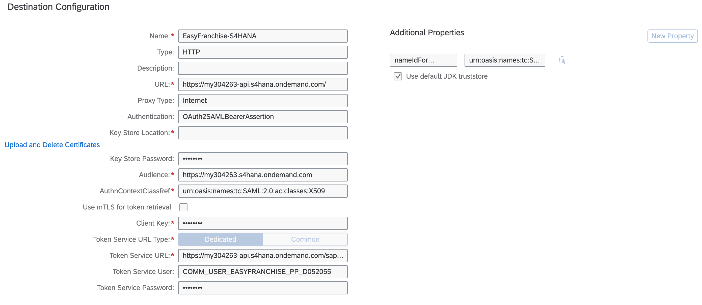
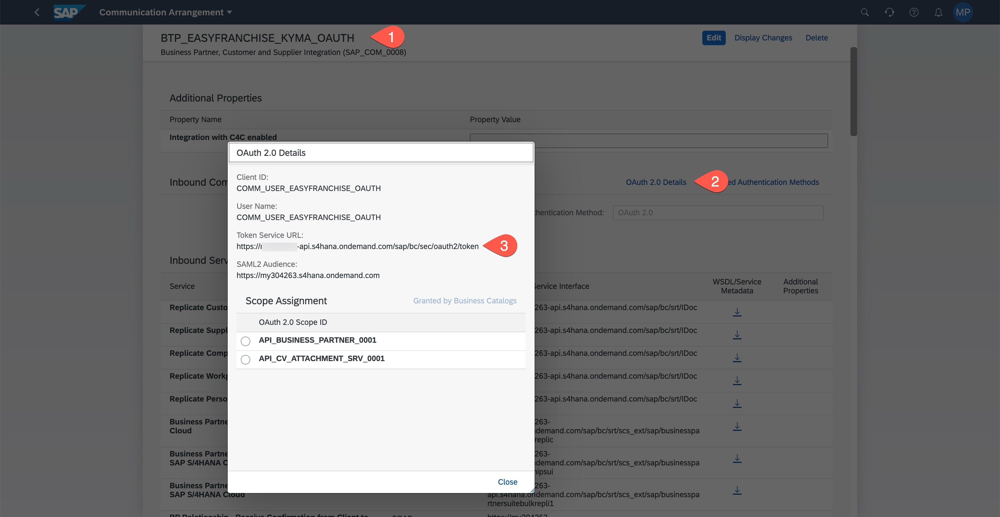

# Configure Destination in SAP BTP to use Principal Propagation

Once OAuth communication settings are configured in S/4HANA Cloud system, we need to update the destination in SAP BTP, which will use user propagation for accessing business partner data from the S/4HANA Cloud system. 

## Update the Destination

1. Go to your customer SAP BTP subaccount and navigate to **Connectivity** > **Destination**. 
1. If you followed the **Prepare** section, you should have a destination called **EasyFranchise-S4HANA**. Edit it now by updating it with the following details.

    | Parameter | Value |
    | --- | --- |
    | Name | EasyFranchise-S4HANA |
    | Type | HTTP |
    |Description | Enter a meaningful description (optional). |
    | URL  | The URL of your S/4HANA Cloud system, e.g. https://my123456-api.s4hana.ondemand.com/. You should have remembered it, when defining the **Communication Arrangement**. 
    | Proxy Type | Internet |
    | Authentication | OAuth2SAMLBearerAssertion |
    | Key Store Location | Leave empty, will be filled automatically. |
    | Key Store Password | Leave empty, will be filled automatically. |
    | Audience | The URL of your SAP S/4HANA Cloud account. To get it, log on to your SAP S/4HANA Cloud account. Select the profile picture. Then choose Settings and copy the value from the <Server> field. Add https:// to the beginning of this string, e.g. https://my123456.s4hana.ondemand.com. This URL does not contain my123456-**api**, but only my123456.|
    | AuthnContextClassRef | urn:oasis:names:tc:SAML:2.0:ac:classes:X509 |
    | Use mTLS for token retrieval | let it unchecked|
    | Client Key | The name of the communication user created previously in the SAP S/4HANA Cloud system, e.g COMM_USER_EASYFRANCHISE_PP |
    | Token Service URL Type | Keep **Dedicated** selected |
    | Token Service URL | For this field, you need the URL copied from the **Communications Arrangements** application e.g. https://my304263-api.s4hana.ondemand.com/sap/bc/sec/oauth2/token. See below note for more details.|
    | Token Service User | The same user as for **Client Key** parameter. |
    | Token Service Password | The password for the communication user. | 
    | nameIdFormat | On the right click **New Property**, and set the value to **urn:oasis:names:tc:SAML:1.1:nameid-format:unspecified**|
    | Use default JDK truststore | selected it|

    

> **NOTE:**  Token Service URL. Open your communication arrangement, click **OAuth2.0 Details** and check your **Token Service URL**.

