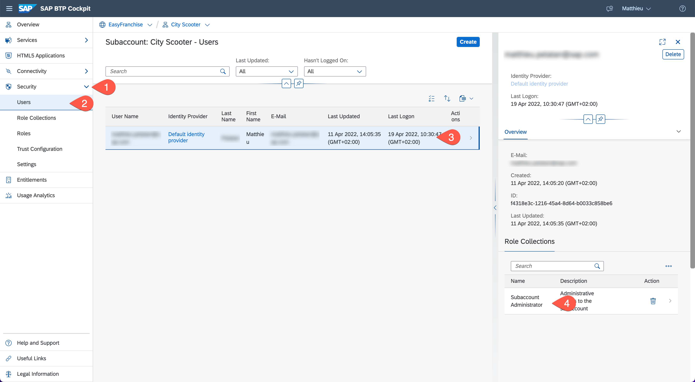
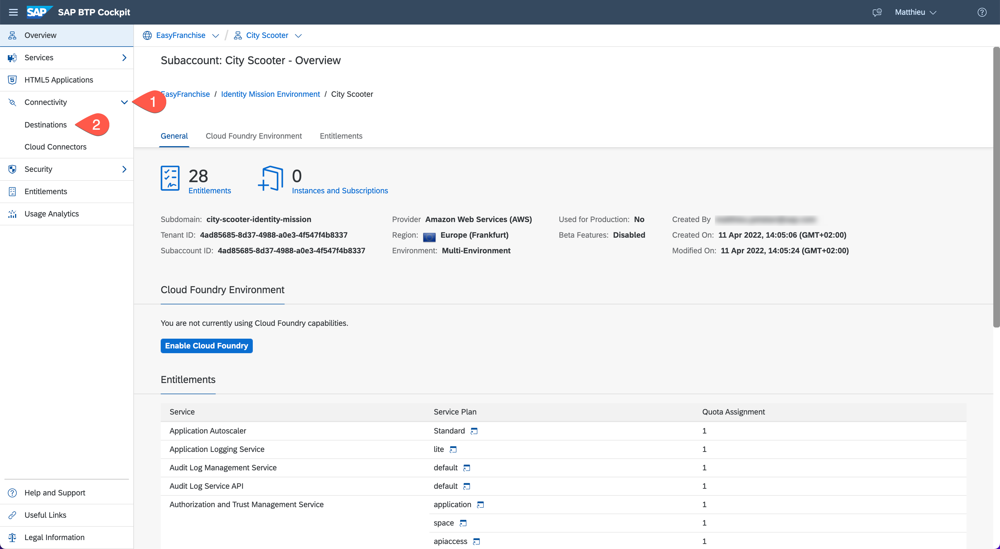
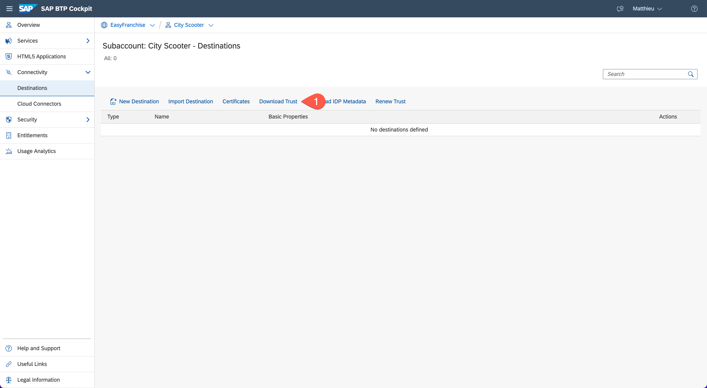

# Configure OAuth Communication

Open the SAP BTP cockpit and log on with Administrator permission. To verify that you have the **Subaccount Administrator** role, choose **Security** > **Users** and check the role for your user.
 

1. Choose **Connectivity** > **Destinations**.
 

1. Choose **Download Trust** and save the identifying X.509 certificate that identifies this subaccount in your local file system. 

The downloaded X.509 certificate will be added in the next step to the target system to which you want to propagate the user.

>**NOTE:** To learn how to renew the certificate, see [Set up Trust Between Systems](https://help.sap.com/docs/CP_CONNECTIVITY/cca91383641e40ffbe03bdc78f00f681/82dbecae3454493782d16a79e30f1a6d.html) at SAP Help Portal.
