# Configure Communication Settings in SAP S/4HANA Cloud

## Prerequisites
You have an SAP S/4HANA Cloud tenant and a user with the following business catalogs assigned:
|Business Role ID | Area        |
| --------------- | ----------- |
|SAP_BCR_CORE_COM | Communication Management|
|SAP_BCR_CORE_IAM | Identity and Access Management|
|SAP_BCR_CORE_EXT | Extensibility|

There are 3 different steps you need to configure the communication settings in SAP S/4HANA Cloud:
* Create a Communication User
* Set up a Communication System for OAuth
* Create a Communication Arrangement

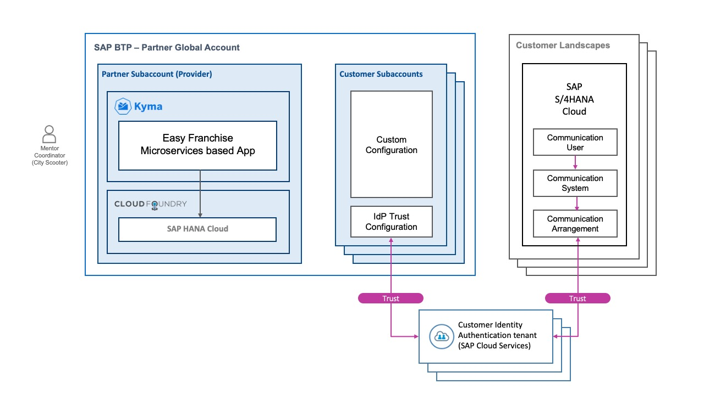

## 1. Create a Communication User

1. From your SAP Fiori launchpad, choose the **Maintain Communication Users** application.

   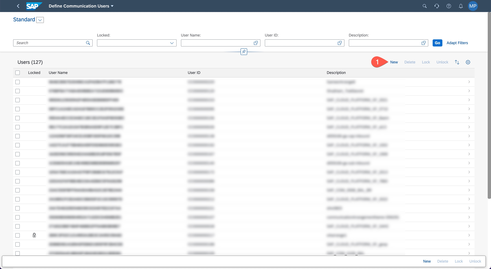
1. From the **User List** view, create a new user, and set the following details:
    * **User Name**: COMM_USER_EASYFRANCHISE_PP
    * **Description**: Whatever you want to describe the user.
    * **Password**: Copy this password as you will need it in a later step.
1. Choose **Create**.

   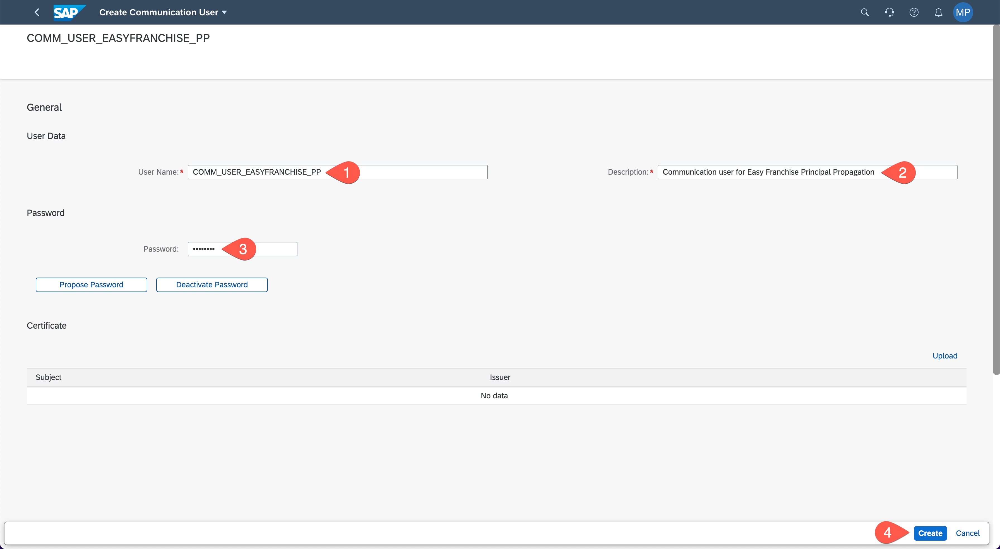
1. Close the **Maintain Communication Users** application.
   
   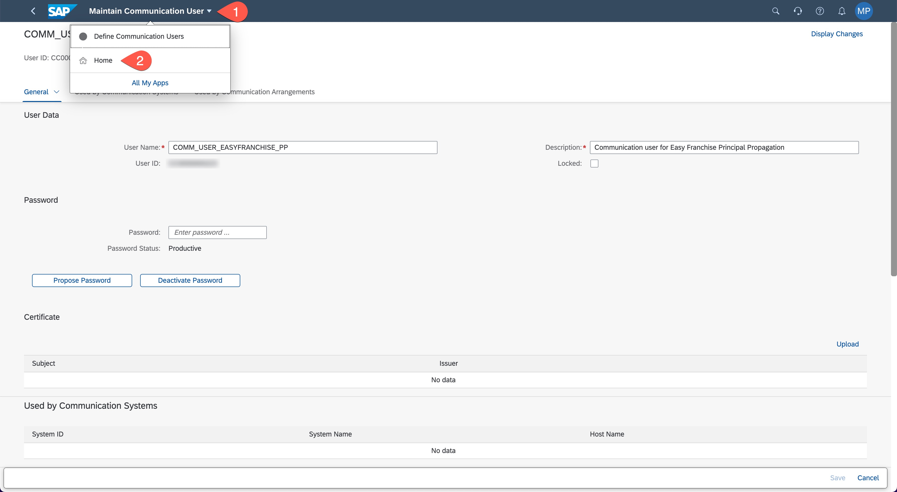

## 2. Set Up a Communication System for OAuth
1. From your launchpad, choose the application **Communication Systems**.

   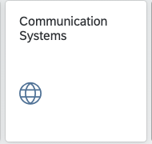 
1. From the list view, choose **New**.
   
   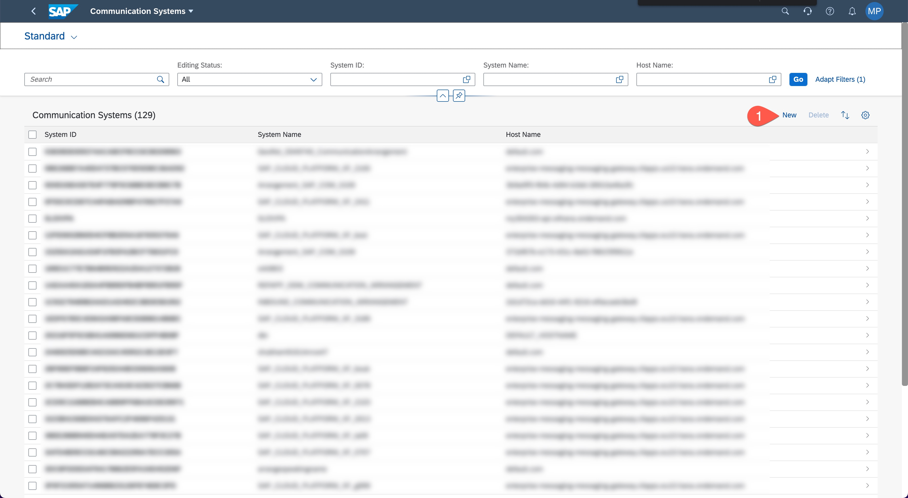
1. Fill in the following details:
   * **System ID**: BTP_EASYFRANCHISE_KYMA
   * **System Name**: BTP_EASYFRANCHISE_KYMA
1. Choose **Create**. 

    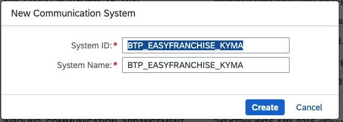
1. Enter the host name. This is your region with an instance of the SAP BTP, Cloud Foundry environment, for example: cf.eu10.hana.ondemand.com for Europe (Frankfurt). For the complete list of standard regions, see [Regions](https://help.sap.com/docs/CP_CONNECTIVITY/cca91383641e40ffbe03bdc78f00f681/350356d1dc314d3199dca15bd2ab9b0e.html?) at SAP Help Portal. In the same section, you can also add a value of your choice for **Logical System** and **Business System**.

    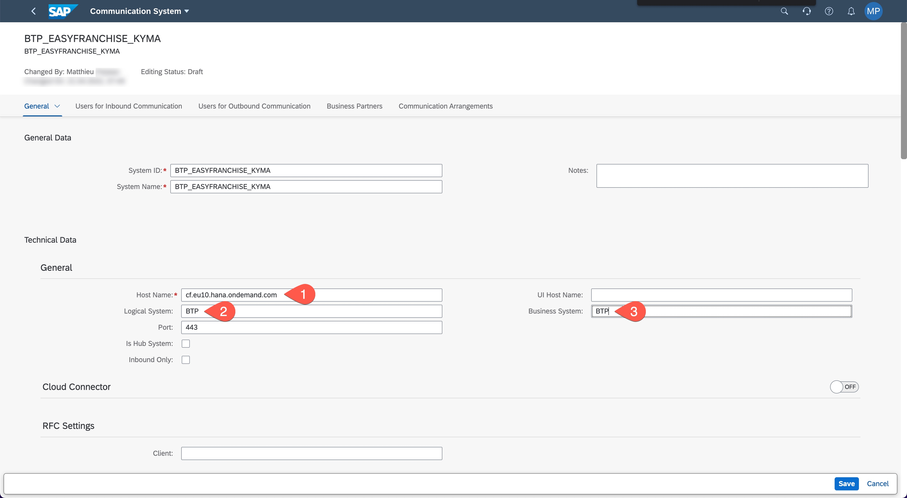
1. Scroll down to the **OAuth 2.0 Identity Provider** section, press the toggle button to activate the section and upload the previously downloaded certificate from your subaccount in SAP BTP.
   
   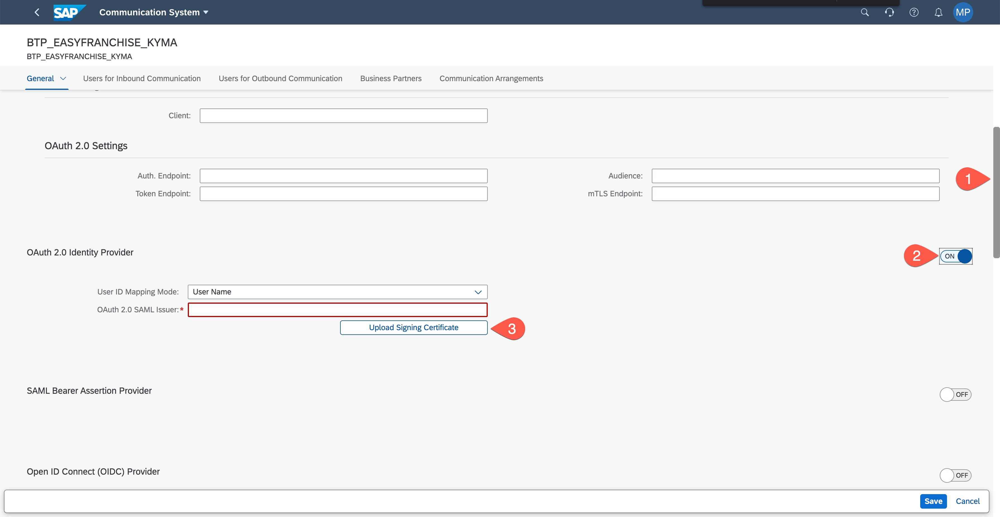
1. From **Signing Certificate Subject**, copy the CN value (for example: cfapps.eu20.hana.ondemand.com/184a0e14--<...>) and paste it in the **OAuth 2.0 SAML Issuer** field.
   
   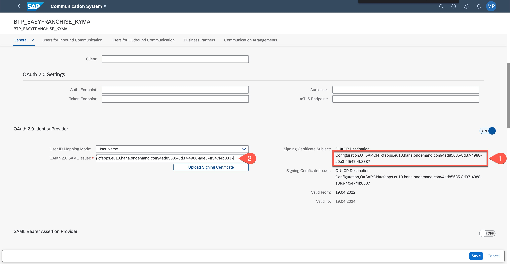
1. Scroll down to the **Users for Inbound Communication** section and choose the **+** icon to add the **Communication User** you have previously created to the system.
   
   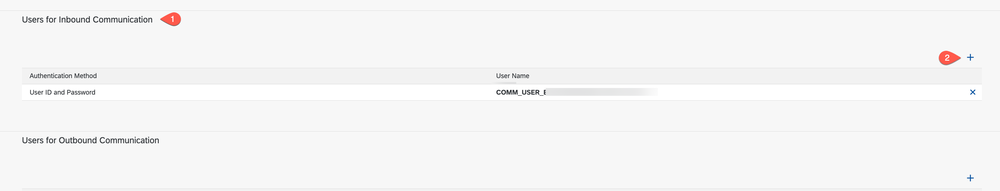 
1. Select the user in the **New Inbound Communication** wizard, choose **OK**, save your settings and then go back to the launchpad.

   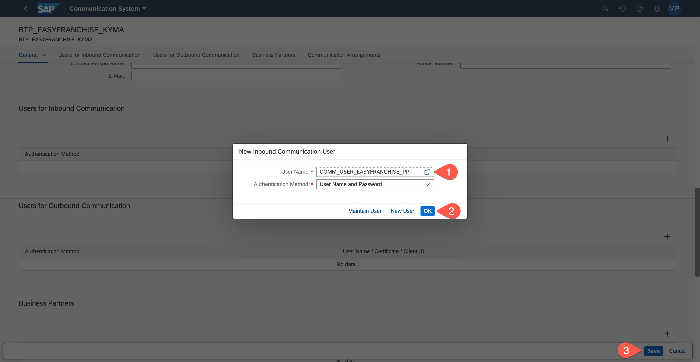

## 3. Create a Communication Arrangement
1. From your launchpad, choose the **Communication Arrangements** application.

   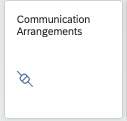
1. From the list view, choose **New**.
   
   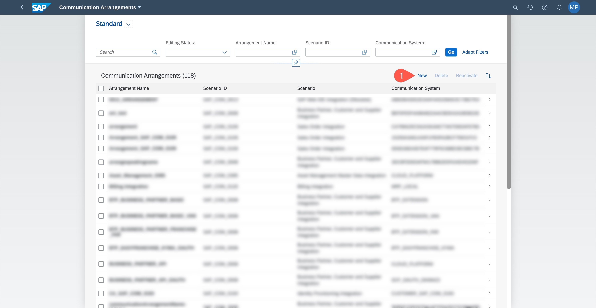
1. In the **New Communication Arrangement** wizard, choose a scenario, set the arrangement name. 
   * **Scenario**: SAP_COM_0008
   * **Arrangement Name**: BTP_EASYFRANCHISE_PP
1. Choose **Create**.

   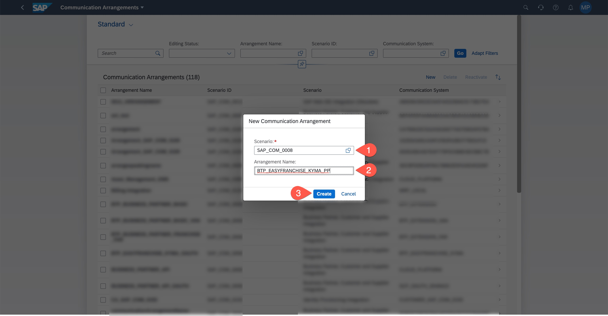
1. In the **Common Data** section of the configuration screen, select the **Communication System** that you have previously created. Then, the values of the **User Name** field of the **Inbound Communication** and the **Authentication Method** field are automatically added.
   
   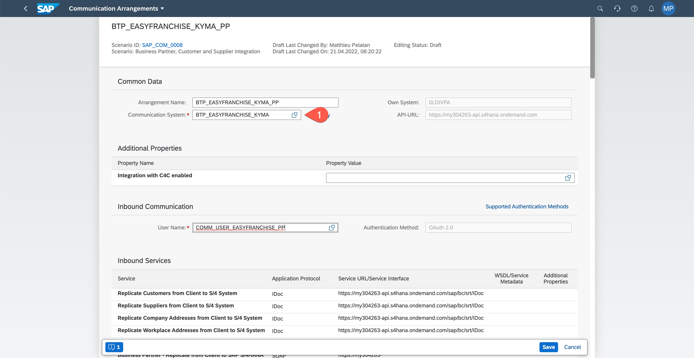

1. In the **Outbound Services** section, uncheck the **Active** checkboxes of the field **Service Status** for all listed services. Then, choose **Save**.
   Remember the Services URL, as you will need this later to update the Destination in the SAP BTP.

   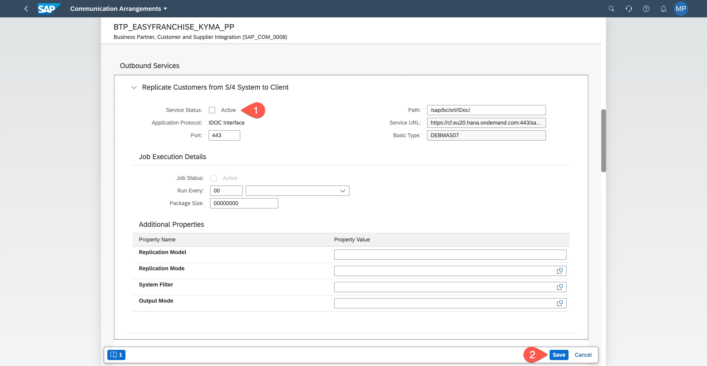

   > **NOTE:** Please check [Note 2820166](https://userapps.support.sap.com/sap/support/knowledge/en/2820166) in case of the error _Enter a Business System ID_.

1. As we will need the Business Partner services URL later for the destination definition, search for service **BusinessPartner (A2X)** in the **Inbound Services** section. The URL has the pattern ```https://<your system id>-api.s4hana.ondemand.com/sap/opu/odata/sap/API_BUSINESS_PARTNER```. As we added the path ```sap/opu/odata/sap/API_BUSINESS_PARTNER``` in the Jva implementation of the Easy Franchise application, you just need to remember the URL without this path.
   
   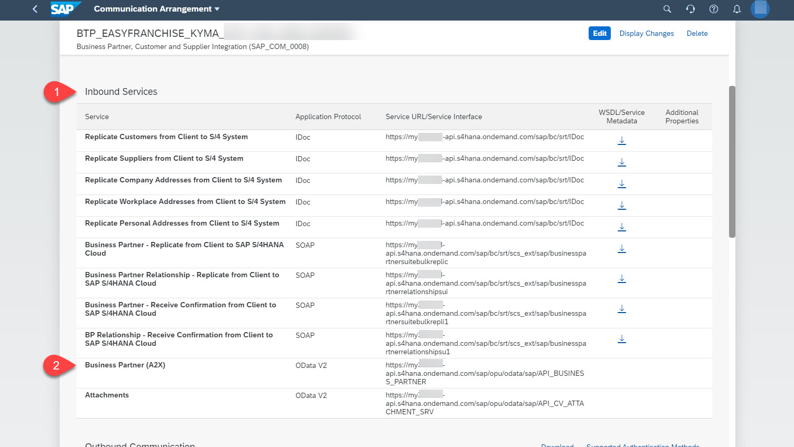
1. In a later Step, when defining the destiantion, you will need some of the OAuth2.0 details, like the **token Service URL** and the **SAML2 Audience**. Open the Details dialog using the **OAuth 2.0 Details** link. 
   
   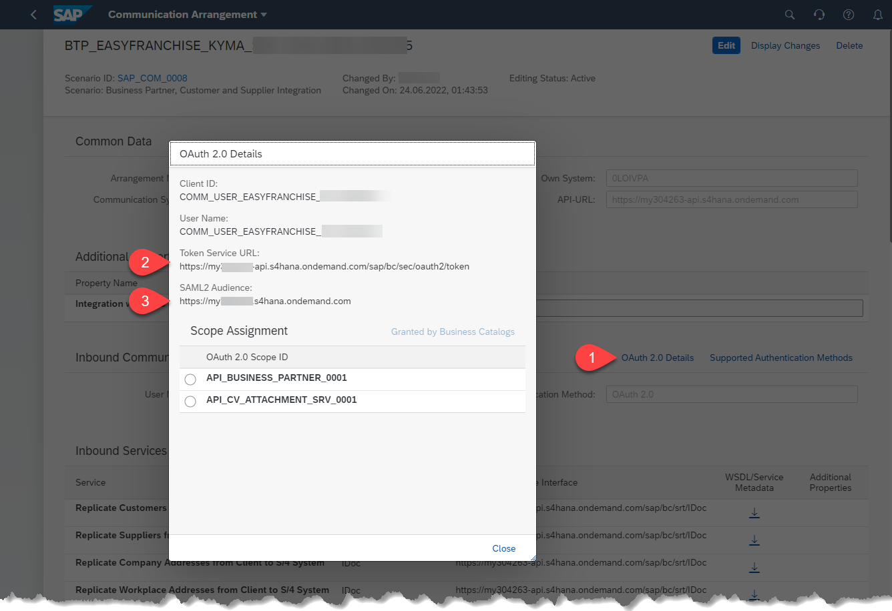
