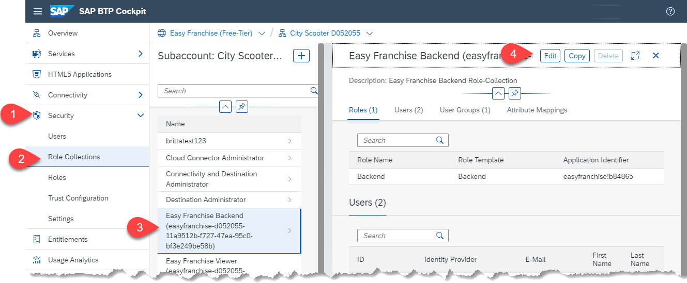
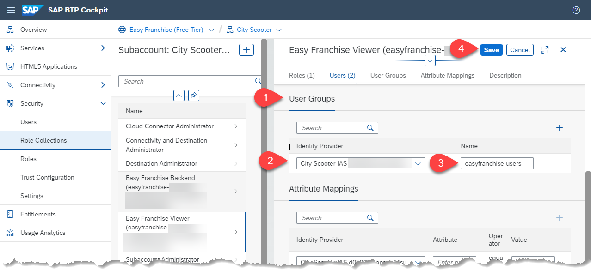
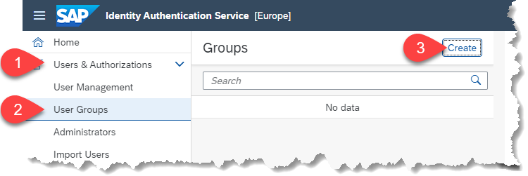
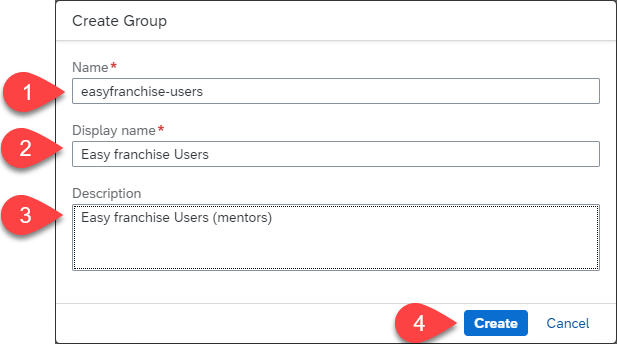
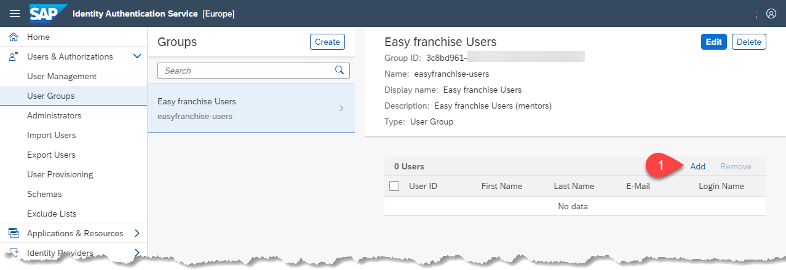
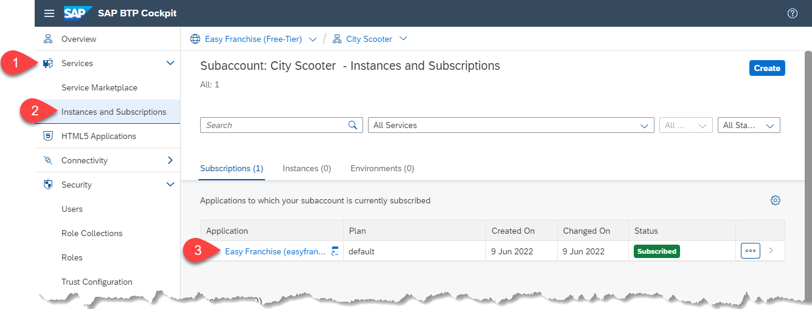

# Manage End User Access for the EasyFranchise Application

## Introduction

To get access to the Easy Franchise application, the user need the role collection **Easy Franchise Backend**.

### Role Assignment by Using Basic Authentication
In this case, the SAP BTP Cockpit offers 2 ways to configure the role assignment:
* Assigning a role collection to a user
* Adding a user to a role collection

### Role Assignment by using Principal Propagation
The tenant admin (eg. City Scooter Admin) can  manage users within his own **Identity Authentication Service**. So he can define by itself, which users will gains access to the Easy Franchise Application and which not. The idea here is that the SAP Partner defines a group name in the SAP BTP Cockpit and provides automatically Easy Franchise Application access for all members, that have been added to this group. 

## Define an Easy Franchise User Group in SAP BTP
This configuration step is done by the partner in the customer subaccount. 

1. Open the SAP BTP Cockpit and log on to the customer SAP BTP subaccount (eg. City Scooter).
1. Open **Security > Role Collections** on the left side menu and choose one of the **Easyfranchise Backend** role collection and click on the **Edit** button. 
   
   
1. Scroll down to **User Groups** and select your Identity Provider. Then provide a name for the group, e.g. **easyfranchise-users**. Save this changes. 
   
   

## Configure the Easy Franchise User Group in the Identity Authentication Service 
If the partner doesn't have access to the customer identity provider, he should share the group name to the customer admin so that he can configure the **Identity Authentication Service** as needed. In our case, we assume that the partner has access to it.

1. Log in to **Identity Authentication Service** and open **User & Authorization > user Groups** on the left side menu. Then press the **Create** button to create a new user group.

   
2. Add the group name, which was created as role collection in the SAP BTP cockpit previously (e.g. **easyfranchise-users**). Provide a meaningful Display name and description. Click **Create** to finalize the group creation. 

   
3. Now add Easy Franchise service end users to this group. Add yourself, so you can test the configuration.

   

## Run the Easyfranchise Application 

Now as we have setup the trust, configured the destination accordingly and configured the user access, we are ready to run the application.

1. Open the application Easy Franchise by clicking on the subscription URL. This can be found in the SAP BTP subaccount under **Instances and Subscriptions**.
   
   
2. In the browser select new identity provider and log in.
   
   
3. Verify that the application works and franchises are loaded. 

   

   > Hint: if you get a "forbidden" error, recheck your configuration, delete browser cache and try again. 
