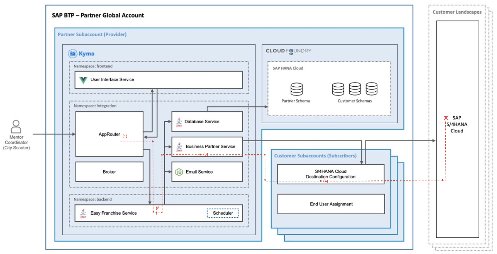

# Consume the destination and run the application

Previously we have configured a destination using **BasicAuthentication** which uses a dedicated technical user. See the [related mission](https://github.com/SAP-samples/btp-kyma-multitenant-extension/tree/main/documentation/test-customer-onboarding/configure-destination) for more details.
In this section we will now create a new destination with **OAuth2SAMLBearerAssertion** type, which enables user propagation when calling S/4HANA Cloud system to retrieve business partners data.  

For user propagation you need [decide on where the user identity is located when calling the Destination service](https://help.sap.com/viewer/cca91383641e40ffbe03bdc78f00f681/Cloud/en-US/3cb7b81115c44cf594e0e3631291af94.html). In our app we use `Field in the JWT` to provide user info for user propagation. Furthermore, we added `nameIdFormat` property in step [4.1], so that the **user-name** element is used as user ID. 

## Authentication Flow
In order to provide a proper JWT token based on our app architecture, we used below flow:



Here is the explanation of the steps in the previous diagram:
1. Approuter acts as a reverse proxy. Upon login, each user request is forwarded to Easy Franchise Service with additional user token in "Authorization" header.
1. The "Authorization" header is then extracted in Easy Franchise service, and is  attached to the HTTP call to Business Partner Service. 
    ```java
        //extract authorization header from Approuter
        String authorizationHeader;
        if (headers != null && headers.getHeaderString(HttpHeaders.AUTHORIZATION) != null){
            authorizationHeader = headers.getHeaderString(HttpHeaders.AUTHORIZATION).replace("Bearer","");
            logger.info("EFService: header(" + HttpHeaders.AUTHORIZATION + ")= " + authorizationHeader);
        }else{
            ...
        }
        //attach header to HTTP call to business partner service
        ConnectionParameter param = new ConnectionParameter(Util.getBPServiceUrl(tenantId) + "bupa");
        param.token = authorizationHeader;
        param.authorizationType = ConnectionParameter.AuthorizationType.BearerToken;
    ```
1. In the Business Partner service, we first need to exchange a user token against destination service (because the original token from Approuter was created using XSUAA credential, while we need a token created using Destination service credentials in order to call Destination service).
    ```java
        // get credential token (without user info) using destination service clientid and clientsecret
        private static String getDestinationServiceXSUAAToken(String subDomain) {
            ...        
            try {
                jwtToken = tokenFlows.clientCredentialsTokenFlow().execute().getAccessToken();
                logger.info("DestinationUtil clientCredentialsTokenFlow: " + jwtToken);
            } catch (IllegalArgumentException | TokenFlowException e) {
                ...
            }
            return jwtToken;
        }
        // get user token by exchanging via token from Approuter
        private static String getDestinationServiceUserToken(String subDomain, String authorizationHeader) {
            ...
            try {
                jwtToken = tokenFlows.userTokenFlow()
                                    .token(authorizationHeader)
                                    .subdomain(subDomain)
                                    .execute()
                                    .getAccessToken();
                logger.info("DestinationUtil userTokenFlow: " + jwtToken);
            } catch (IllegalArgumentException | TokenFlowException e) {
                ...
            }
            return jwtToken;
        }
    ```
1. With the new token exchanged from step 3, we will call the Destination service API called [Find A Destination](https://api.sap.com/api/SAP_CP_CF_Connectivity_Destination/resource). The call will returns an auth token as described [here](https://help.sap.com/viewer/cca91383641e40ffbe03bdc78f00f681/Cloud/en-US/83a3f3b9cd314618aba651044ed5b9df.html).
    ```java
        if(authorizationHeader == null || authorizationHeader.isEmpty()){
            // no authorization header, create a credentialtoken WITHOUT userinfo, 
            // in which case Destination with pricipal propagation (OAuth2SAMLBearerAssertion) is not possible, only Basic authentication works
            param.token = getDestinationServiceXSUAAToken(subDomain);

        }else {
            // using pricipal propagation,  exchange user token from EFservice (set by Approuter) to user token using destination credentials
            param.token = getDestinationServiceUserToken(subDomain, authorizationHeader);
        }

        param.authorizationType = ConnectionParameter.AuthorizationType.BearerToken;
        param.setAcceptJsonHeader();

        Connection.call(param);
        ...
    ```
1. Use the auth token from step 4 and make an OData call to the S/4HANA Cloud system to retrieve the business partners data. 
    ```java
        // Call S4 Hana Cloud system with the connection parameter (e.g. Username/Password, or token)
        ConnectionParameter param = DestinationUtil.getDestinationData(subdomain, Util.getS4HanaDestinationName(), authorizationHeader).setAcceptJsonHeader();
        
        // set subdomain dynamically as search term
        String searchString = BUSINESS_PARTNER_ODATA_REQUEST.replace("<cf-subdomain>", subdomain);
        param.updateUrl(param.getUrl() + searchString);
        Connection.call(param);
        ...
    ```

> **NOTE:**: For destination using BasicAuthentication, we only need step 3, 4 and 5. The only difference is that in step 3 we did not exchange user token, but create credential token (without user info in JWT) against Destination service.


## Switch from BasicAuthentication and OAuth2SAMLBearerAssertion type of destination
1. Open the file [backend-configmap.yaml](../../../code/backend/config/backend-configmap.yaml) where the destination used by Easy Franchise app is defined.

1. Update **s4hana.destination** to the new name of the destination created previously: **EasyFranchise_PrincipalPropagation**.
    ```yaml
    apiVersion: v1
    kind: ConfigMap
    metadata:
    name: backend-configmap  
    data:
    backend.properties: |
        ...
        s4hana.destination: EasyFranchise_PrincipalPropagation
    ```
1. Update the config map by running the below command.
    ```shell
    # under backend folder
    kubectl apply -n backend -f ./config/backend-configmap.yaml
    kubectl apply -n integration -f ./config/backend-configmap.yaml
    ```
1. That's all, you can now run the application and the user principal will be forwarded to login in the S/4HANA system.