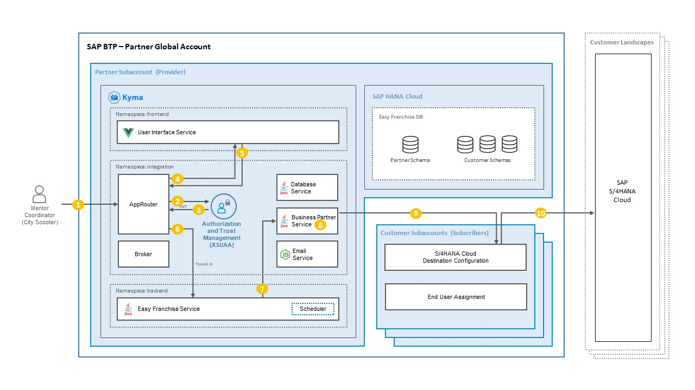

# Understand the Principal Propagation Authentication Flow

In the related mission [Easy Franchise: Develop a Multitenant Extension Application in SAP BTP, Kyma Runtime](https://github.com/SAP-samples/btp-kyma-multitenant-extension) we have configured destinations using **BasicAuthentication** which uses a dedicated technical user. For more details, see the [**related mission**](https://github.com/SAP-samples/btp-kyma-multitenant-extension/tree/main/documentation/test-customer-onboarding/configure-destination) page.

Switching the destination  type to **OAuth2SAMLBearerAssertion** will enables user propagation when calling the SAP S/4HANA Cloud system to retrieve the business partners data. 

When all implementations involved are prepared to handle both destination types, one client can continue to use **BasicAuthentication** while another can be switched to **OAuth2SAMLBearerAssertion**.

For user propagation you need to determine the source of propagated user ID when calling the Destination service. There are three sources that can provide the propagated user ID. Please see [User Propagation via SAML 2.0 Bearer Assertion Flow](https://help.sap.com/viewer/cca91383641e40ffbe03bdc78f00f681/Cloud/en-US/3cb7b81115c44cf594e0e3631291af94.html) for further details. In our application, we use **Field in the JWT** as source to provide the user information. Furthermore, **nameIdFormat** property is configured in section [Configure Destination in SAP BTP to use Principal Propagation](../configure-destination/README.md), so that the user-name element is used as a user ID.

## Authentication Flow
In order to provide a proper JWT token based on our application architecture, we used the flow below:



Here is the explanation of the steps in the previous diagram:

1. An end user opens the application in a browser. The browser sends a request to the Approuter.
1. The end user is redirected to the SAP Authorization and Trust Management service to log in.
1. After a successful login, the SAP Authorization and Trust Management service sends a JWT token to Approuter, which extracts the tenant ID. The tenant ID will be needed later to call the data from the right tenant.
1. The Approuter redirects to UI.
1. The UI sends a request to backend API via the Approuter.
1. The Approuter injects an additional user token in the **Authorization** header and forwards the request to the Easy Franchise service. 
1. The [Easy Franchise service](../../../code/easyfranchise/source/backend/ef-service/src/main/java/dev/kyma/samples/easyfranchise/EFService.java) receives request as an orchestrator and forwards it to the respective microservice including The **Authorization** header. 
   
   ```java
   public Response getBusinessPartner(@PathParam("tenantId") String tenantId, @Context UriInfo uri, @Context HttpHeaders headers, @Context ContainerRequestContext resContext) {
     //extract authorization header from Approuter
     String authorizationHeader;
     if (headers != null && headers.getHeaderString(HttpHeaders.AUTHORIZATION) != null) {
        authorizationHeader = headers.getHeaderString(HttpHeaders.AUTHORIZATION).eplace("Bearer","");
     }   
     ...
   ```
   When calling the Business Partners in [EFUtil.java](../../../code/easyfranchise/source/backend/ef-service/src/main/java/dev/kyma/samples/easyfranchise/EFUtil.java) the authorization header is used.

   ```java
   private static A_BusinessPartner getBusinessPartnerFromS4(String tenantId, String authorizationHeader) {
     //attach header to HTTP call to business partner service
     ConnectionParameter param = new ConnectionParameter(Util.getBPServiceUrltenantId) + "bupa");
     if(authorizationHeader != null && !authorizationHeader.isEmpty()){
       param.token = authorizationHeader;
       param.authorizationType = ConnectionParameter.AuthorizationType.BearerToken;
     }
   ...

   ```
1. In the [Business Partner service](../../../code/easyfranchise/source/backend/bp-service/src/main/java/dev/kyma/samples/easyfranchise/bpservice/BPService.java), we first need to exchange a user token against the one from the Destination service because the original token from Approuter was created using XSUAA credentials, while we need now a token created using the Destination service credentials in order to call the Destination service.

   This is implemented in the [DestinationUtil class](../../../code/easyfranchise/source/backend/shared-code/src/main/java/dev/kyma/samples/easyfranchise/communication/DestinationUtil.java):
   
   ```java
   // get user token by exchanging via token from Approuter
   private static String getDestinationServiceUserToken(String subDomain, String authorizationHeader) {
       ...
       try {
           jwtToken = tokenFlows.userTokenFlow()
                               .token(authorizationHeader)
                               .subdomain(subDomain)
                               .execute()
                               .getAccessToken();
       } catch (IllegalArgumentException | TokenFlowException e) {
           ...
       }
       return jwtToken;
   }
   ```

    > **NOTE:** By using BasicAuthentication in the destination, we didn't exchange a **user token** in step 8.  Instead of that, we create a **credential token** (without user info in JWT field) from the Destination service with the following method:

    ```java
    // get credential token (without user info) using destination service clientid and clientsecret
    private static String getDestinationServiceXSUAAToken(String subDomain) {
        ...        
        try {
            jwtToken = tokenFlows.clientCredentialsTokenFlow().execute().getAccessToken();
        } catch (IllegalArgumentException | TokenFlowException e) {
            ...
        }
        return jwtToken;
    }

    ```

1. Depending on the type of Desitnation (`BasicAuthentication` or `OAuth2SAMLBearerAssertion`), different token (`credential token` or `user token`) will be retrieved by calling corresponding methods defined in step 8. With the new token the Destination service API  [Find A Destination](https://api.sap.com/api/SAP_CP_CF_Connectivity_Destination/resource) will be called.  The call then returns an OAuth token as described in ["Find Destination" Response Structure](https://help.sap.com/viewer/cca91383641e40ffbe03bdc78f00f681/Cloud/en-US/83a3f3b9cd314618aba651044ed5b9df.html) in SAP Help Portal.

    ```java
    if(authorizationHeader == null || authorizationHeader.isEmpty()){
        // no authorization header, create a credentialtoken WITHOUT userinfo, 
        // in which case Destination with pricipal propagation (OAuth2SAMLBearerAssertion) is not possible, only Basic authentication works
        param.token = getDestinationServiceXSUAAToken(subDomain);
    } else {
        // using pricipal propagation,  exchange user token from EFservice (set by Approuter) to user token using destination credentials
        param.token = getDestinationServiceUserToken(subDomain, authorizationHeader);
    }
    param.authorizationType = ConnectionParameter.AuthorizationType.BearerToken;
 
    Connection.call(param);
    ...
    ```
1. The Business Partner service uses the OAuth token and make an OData call to the SAP S/4HANA Cloud system to retrieve the business partners data. 
    ```java
    // Call S4 Hana Cloud system with the connection parameter (e.g. Username/word, or token)
    ConnectionParameter param = DestinationUtil.getDestinationData(subdomain, .getS4HanaDestinationName(), authorizationHeader).setAcceptJsonHeader();
    
    // set subdomain dynamically as search term
    String searchString = BUSINESS_PARTNER_ODATA_REQUEST.replacef-subdomain>", subdomain);
    param.updateUrl(param.getUrl() + searchString);
    Connection.call(param);
    ...
    ```

