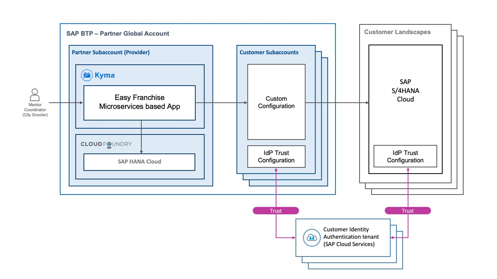

# Set Trust Between SAP BTP and SAP S/4HANA Tenant Using Identity Authentication Service

To implement principal propagation, we need to establish a trust between the subaccount in SAP BTP and the SAP S/4HANA Cloud tenant. For this purpose, we use the Identity Authentication service to act as the component in the middle. So we have a two-step approach:
1. Setting the trust between the subaccount in SAP BTP and the Identity Authentication service.
1. Setting the trust between the SAP S/4HANA Cloud tenant and the Identity Authentication service.

In the previous chapter, we have already explained how to connect an Identity Authentication tenant to a subaccount in SAP BTP. See [Set Trust between Identity Authentication tenant and SAP BTP Subaccount](../../configure-ias/set-trust-between-ias-and-btp/README.md).

Regarding the trust between the SAP S/4HANA Cloud tenant and the Identity Authentication tenant, it depends on which system you are using:
1. In case you are using SAP S/4HANA Cloud: you have already got such your SAP S/4HANA Cloud tenant delivered by SAP with a configured trust between this tenant and the SAP Cloud Identity Services - Identity Authentication tenant. Just be sure to use the very same Identity Authentication tenant.
1. In case you are using SAP S/4HANA: to establish the trust, follow the steps at [Configure SAML Trust between SAP S/4HANA System and Identity Authentication Service](https://help.sap.com/viewer/f36ad14527694a6fad161093090618ec/latest/en-US/af32c1c89b994eb2998f0b30169a0bf9.html) at SAP Help Portal.

> **NOTE:** For more information, see [Configuration Tasks](https://help.sap.com/viewer/cca91383641e40ffbe03bdc78f00f681/Cloud/en-US/6e5e004b6553403486a03da53bfcaf4e.html) at SAP Help Portal.
